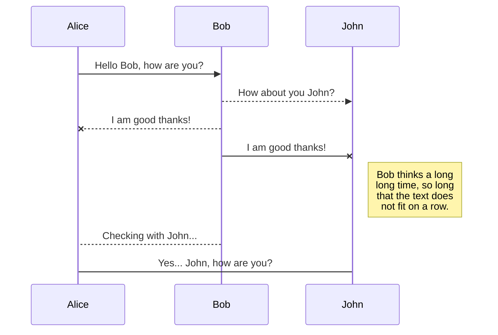
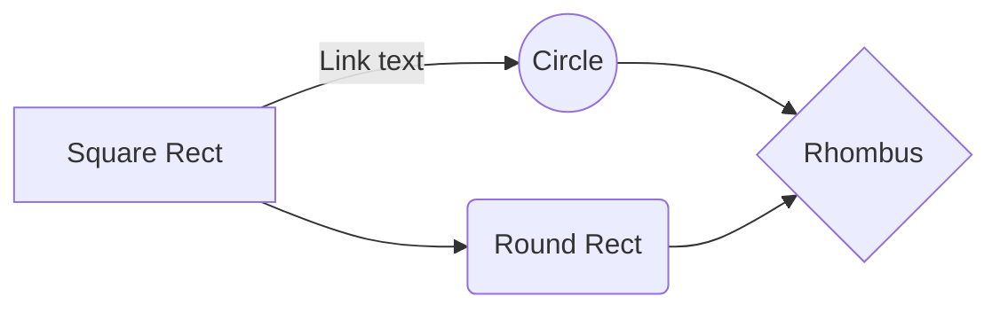

# Moni Watch

 - ## Présentation de l'application

	 Application de gestion de compte bancaire en client lourd. Cette application doit pouvoir gérer **plusieurs comptes utilisateur**  appelés "**Monies**". Un Moni peut CRUD un/plusieurs **BankAccount** (Un car création du premier prévu pour être obligatoire à la création de l'utilisateur).
	 
	Un utilisateur peut CRUD des **Transactions**, ces transactions sont liées à UN BankAccount et doivent avoir de un à plusieurs **Tags**. 
	
	Ces Tags peuvent être crées/supprimés par l'utilisateur ou fournis par défaut (**IMPORTANT dans la gestion de la BDD ceci ne sera *à priori* pas une clé primaire**).
	
	Mon application tournera avec une API REST sur mon raspberry qui sera aussi le serveur de ma base de données (je pense utiliser MySQL).
	
	*Les applications clientes ne sont pas encore définies en terme d'OS accepté. Je partirai peut être sur du WinForms par rapport à la facilité d'apprentissage (vu en cours). Mais vu que je dev à moitié sous Ubuntu et que la machine que je risque d'amener pour l'épreuve est sous Ubuntu, je pourrais me tourner ver AvaloniaUI (à voir par rapport à la courbe d'apprentissage).* 

>	***Ajout bonus**
>_  Ajouter un système de transaction direct entre des comptes de différents utilisateurs "contacts" qui pourraient s'ajouter par  recherche de login, pour le Moni source, qui envoie une demande au Moni cible.
>_ Rendre possible la répétition automatique d'une transaction à des dates données.* 

- ## Entités
	- ### Moni : 
	Les utilisateurs de l'application, ils auront un FirstName, LastName, un Login (unique) et un Password. Ce sont les propriétaires des BankAccount et des Tag.
	- ### BankAccount :
	Les comptes en banque qui seront la propriété des Moni, ils contiendront les transactions. Ils auront un Name, une CreationDate, une Balance.
	- ### Tag :
	Les Tag sont des balises créées par l'utilisateur pour trier leurs transactions. Elle ne possède **à priori** qu'un Label ainsi qu'une Description. Elles sont la propriété d'un (et un seul) Moni.
	- ### Transaction :
	L'entité avec laquelle on fera le plus de traitement, cette entité contient un Label, une Description, un Amount, une TransactionDate. Elle est la propriété d'un BankAccount.
	
----------------------------------------------
----------------------------------------------

# Markdown extensions

StackEdit extends the standard Markdown syntax by adding extra **Markdown extensions**, providing you with some nice features.

> **ProTip:** You can disable any **Markdown extension** in the **File properties** dialog.

## SmartyPants

SmartyPants converts ASCII punctuation characters into "smart" typographic punctuation HTML entities. For example:

|                |ASCII                          |HTML                         |
|----------------|-------------------------------|-----------------------------|
|Single backticks|`'Isn't this fun?'`            |'Isn't this fun?'            |
|Quotes          |`"Isn't this fun?"`            |"Isn't this fun?"            |
|Dashes          |`-- is en-dash, --- is em-dash`|-- is en-dash, --- is em-dash|

## KaTeX

You can render LaTeX mathematical expressions using [KaTeX](https://khan.github.io/KaTeX/):

The *Gamma function* satisfying $\Gamma(n) = (n-1)!\quad\forall n\in\mathbb N$ is via the Euler integral

$$
\Gamma(z) = \int_0^\infty t^{z-1}e^{-t}dt\,.
$$

> You can find more information about **LaTeX** mathematical expressions [here](http://meta.math.stackexchange.com/questions/5020/mathjax-basic-tutorial-and-quick-reference).

## UML diagrams

You can render UML diagrams using [Mermaid](https://mermaidjs.github.io/). For example, this will produce a sequence diagram:

And this will produce a flow chart:

