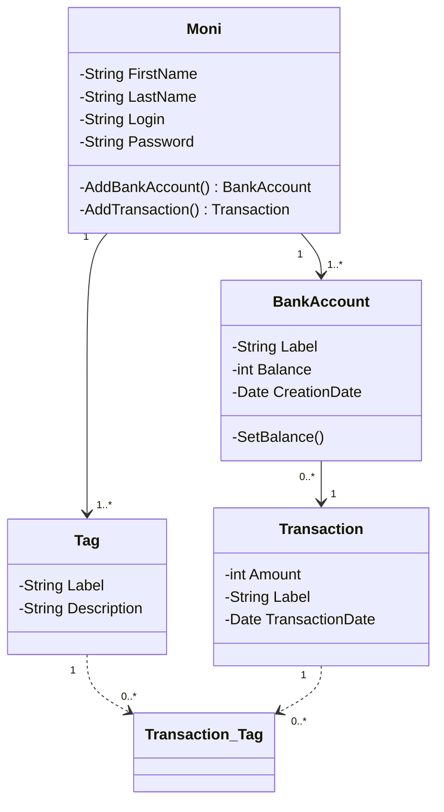

# Moni Watch

  

-  ## Présentation de l'application

  

Application de gestion de compte bancaire en client lourd. Cette application doit pouvoir gérer **plusieurs comptes utilisateur** appelés "**Monies**". Un Moni peut CRUD un/plusieurs **BankAccount** (Un car création du premier prévu pour être obligatoire à la création de l'utilisateur).

Un utilisateur peut CRUD des **Transactions**, ces transactions sont liées à UN BankAccount et doivent avoir de un à plusieurs **Tags**.

Ces Tags peuvent être crées/supprimés par l'utilisateur. Je dois penser à la possibilité de les fournir par défaut, ce qui est plus génant que prévu :
- Je créé des Tag par défaut à la création de chaque utilisateur, problème : Information redondante
- Je créé un utilisateur "Fantome" qui sera le propriétaires de Tags et chaque autre utilisateur aura accès à ses Tags, problème : Je romps ma contrainte de propriété exclusive des Tags pour UN utilisateur et dois l'implementer.
- Je ne mets pas de contrainte de clé étrangère entre Moni et Tag mais j'en *simule* une avec un attribut MoniId qui pourra être nullable. Dans le cas où l'attribut est null, il s'agira d'un Tag par défaut utilisable par tous. Correspond à peu près à la solution 1 mais implique de créer un trigger pour gérer la suppression en cascade lors de la suppression d'un Moni. Il faut aussi faire attention à empècher la suppression des Tags par défaut. 
- Dernière solution -> Ne pas créer de Tags par défaut (Finalement peut être la plus logique en terme d'archi autant qu'en terme d'experience utilisateur)

Mon application tournera avec une API REST sur mon raspberry qui sera aussi le serveur de ma base de données (je pense utiliser MySQL).

*Les applications clientes ne sont pas encore définies en terme d'OS accepté. Je partirai peut être sur du WinForms par rapport à la facilité d'apprentissage (vu en cours). Mais vu que je dev à moitié sous Ubuntu et que la machine que je risque d'amener pour l'épreuve est sous Ubuntu, je pourrais me tourner ver AvaloniaUI (à voir par rapport à la courbe d'apprentissage).*

  

> ***Ajout bonus**

>_ Ajouter un système de transaction direct entre des comptes de différents utilisateurs "contacts" qui pourraient s'ajouter par recherche de login, pour le Moni source, qui envoie une demande au Moni cible.

>_ Rendre possible la répétition automatique d'une transaction à des dates données.*

  

-  ## Entités

-  ### Moni :

Les utilisateurs de l'application, ils auront un FirstName, LastName, un Login (unique) et un Password. Ce sont les propriétaires des BankAccount et des Tag.

-  ### BankAccount :

Les comptes en banque qui seront la propriété des Moni, ils contiendront les transactions. Ils auront un Name, une CreationDate, une Balance.

-  ### Tag :

Les Tag sont des balises créées par l'utilisateur pour trier leurs transactions. Elle ne possède **à priori** qu'un Label ainsi qu'une Description. Elles sont la propriété d'un (et un seul) Moni.

-  ### Transaction :

L'entité avec laquelle on fera le plus de traitement, cette entité contient un Label, une Description, un Amount, une TransactionDate. Elle est la propriété d'un BankAccount. Quand un utilisateur en rajoute une, le BankAccount associé voit son attribut Balance évoluer.

----------------------------------------------

